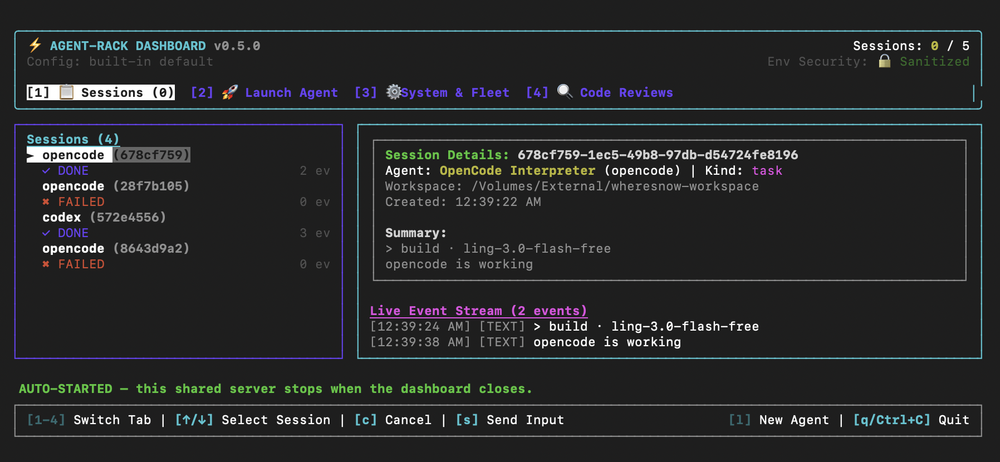

<div align="center">

<picture>
  <source media="(prefers-color-scheme: dark)" srcset="./assets/agent-rack-wordmark-dark.svg">
  
</picture>

# agent-rack — run CLI AI coding agents as MCP tools

**Bridge any CLI coding agent into any MCP client**<br>
An MCP server for delegating work to Claude Code, Codex, opencode, and Antigravity sub-agents —
from Claude Code, Claude Desktop, Cursor, VS Code, or any other MCP client.

[](https://www.npmjs.com/package/agent-rack)
[](./LICENSE)
[](package.json)

</div>

---

`agent-rack` wraps command-line AI coding agents behind a single [Model Context
Protocol](https://modelcontextprotocol.io) server. It ships with four agents built in —
`claude`, `codex`, `opencode`, and Antigravity (`agy`) — but isn't limited to them: any other
local CLI coding agent can be wired in with a small adapter (see
[Connecting your own CLI agent](#connecting-your-own-cli-agent)). Point any MCP client at it, and it spawns sub-agents
synchronously for one-shot tasks, or as background sessions with log streaming, follow-up
input, and cancellation.

It also ships a structured, adversarial-capable **code review** tool
(`agent_review`) that runs read-only and returns validated JSON instead of free text, plus
[9 packaged commands and 2 auto-activated guidance skills](#skills) for Claude Code, Cursor, and
Antigravity.

---

## Contents

- [What it's for](#what-its-for) — why delegate to a CLI sub-agent at all
- [Supported MCP clients and agents](#supported-mcp-clients-and-agents)
- [Install](#install) — Claude Code plugin, `setup` wizard, or per-client `install`
- [Requirements](#requirements)
- [MCP tools](#mcp-tools) — `agent_run`, `agent_session_*`, per-agent shortcuts
- [Skills](#skills) — slash commands for Claude Code, Cursor, Antigravity
- [Structured code review (`agent_review`)](#structured-code-review-agent_review)
- [How it works](#how-it-works) — adapters, engine, tools
- [Configuration](#configuration) — `agent-rack.config.json`, adding an agent profile
- [Security model](#security-model) — workspace boundary, execution policy, SSE auth
- [CLI commands](#cli-commands) — `start`, `setup`, `dashboard`, `session`, `agents`, …
- [Troubleshooting](#troubleshooting)
- [FAQ](#faq)
- [Connecting your own CLI agent](#connecting-your-own-cli-agent)
- [Contributing](#contributing) · [License](#license)

## What it's for

The main thing agent-rack buys you is **another agent's context, not just another tool call**. A
sub-agent reads files, runs commands, and reasons on its own budget, then hands back a result —
so the work never lands in your main conversation's context window.

- **Parallel sub-agents.** Fan several background sessions out at once (`agent_session_create`),
  poll them, and collect results — a test-fixing session, a docs session, and a refactor session
  running side by side.
- **Second-opinion code review.** Have Codex review what Claude Code just wrote (or the reverse)
  via [`agent_review`](#structured-code-review-agent_review), and get validated JSON findings
  back instead of prose you have to re-read.
- **Model and vendor diversity.** Your client stays whatever you like using; the sub-agent can be
  a different CLI, a different vendor, and a different model per call
  (see [Changing models](#changing-models)).
- **Long-running work off the critical path.** Start a migration or a large test run as a
  background session, keep working, and check on it with `agent_session_logs` or the
  [terminal dashboard](#dashboard-alias-ui).
- **One protocol for every CLI.** Any local CLI coding agent — including one that isn't built in
  — becomes the same set of MCP tools everywhere
  (see [Connecting your own CLI agent](#connecting-your-own-cli-agent)).

You keep using whichever CLIs you already pay for: agent-rack drives the binaries on your
`$PATH` with your existing logins. It never asks for an API key and never calls a model itself.

## Supported MCP clients and agents

Clients agent-rack can register itself with (see [Install](#install)):

| MCP client | Command | Scope |
| --- | --- | --- |
| Claude Code | `agent-rack install --target claude` (or the [plugin](plugins/agent-rack/README.md)) | project or user |
| Codex CLI | `agent-rack install --target codex` | user |
| Claude Desktop | `agent-rack install --target desktop` | user (macOS path) |
| Cursor | `agent-rack install --target cursor` | project or user |
| Antigravity | `agent-rack install --target antigravity` | user |
| OpenCode | `agent-rack install --target opencode` | user |
| VS Code, GitHub Copilot, anything else | `agent-rack snippet vscode` → paste the JSON | — |

Agents it can spawn as sub-agents:

| Agent | Agent id | CLI | Transport | Follow-up input |
| --- | --- | --- | --- | --- |
| Claude Code | `claude` | `claude` | `claude_stream_json` | yes — `resume` |
| Codex | `codex` | `codex` | `codex_exec_json` | yes — `resume` |
| OpenCode | `opencode` | `opencode` | `pty_interactive` | yes — `live` |
| Antigravity | `agy` | `agy` | `agy_stream` | no |
| Your own CLI | anything | anything | `pty_interactive` or a [custom adapter](#connecting-your-own-cli-agent) | depends |

See [Follow-up input](#follow-up-input) for what `live` and `resume` mean — they need the session
to be in *opposite* states.

## Install

**Using Claude Code?** Skip the steps below entirely and install the
[Claude Code plugin](plugins/agent-rack/README.md) instead — it registers the MCP server
automatically and adds slash commands (`/agent-rack:run`, `/agent-rack:review`, …) for every tool:

```
/plugin marketplace add lakpriya1s/agent-rack
/plugin install agent-rack@agent-rack
/reload-plugins
```

For every other MCP client, no cloning, no config file to write by hand — just register it.
Not sure which targets apply to you? Run the interactive wizard instead — it detects what's
actually installed (including project-local `.claude`/`.cursor` folders, offering
project-vs-global registration for those two) and asks before registering with each:

```sh
npx agent-rack setup
```

Or register with a specific target directly:

```sh
npx agent-rack install --target claude       # Claude Code CLI
npx agent-rack install --target codex        # Codex CLI
npx agent-rack install --target desktop      # Claude Desktop
npx agent-rack install --target cursor       # Cursor
npx agent-rack install --target antigravity  # Antigravity
npx agent-rack install --target opencode     # OpenCode
npx agent-rack snippet vscode                # print a snippet to paste anywhere else
```

`claude` and `cursor` also accept `--scope project` to register only for the current project
(a git-shareable `.mcp.json`/`.cursor/mcp.json` in the project root) instead of globally for
every project — see [`install`](#install) below for details.

Then restart your MCP client to pick up the new tools. That's it — with no config file present,
agents are automatically scoped to whichever directory your MCP client launches the server
from (almost always your project root). See [Configuration](#configuration) below only if you
need to customize that.

Prefer a global install so the `agent-rack` command is always on hand?

```sh
npm install -g agent-rack
agent-rack install --target claude
```

> `--target desktop` writes to macOS's Claude Desktop config path
> (`~/Library/Application Support/Claude/claude_desktop_config.json`). On other platforms, run
> `agent-rack snippet claude-desktop` and paste the printed JSON into your config by hand.

### Adding another client later

None of this is a one-time-only step. `install --target <x>` and `setup` are both safe to run
again at any point after your first install — each target's registration is independent, so
adding Cursor six months after you set up Claude Code doesn't touch Claude Code's registration at
all, and re-running the same target is idempotent (it just confirms/repairs that one entry).
There's nothing to migrate and no shared state between clients to keep in sync — every client
still resolves the same `agent-rack.config.json` (see [Configuration](#configuration)), it's only
*which clients know to spawn agent-rack* that changes. Just restart the newly-registered client
afterward to pick up the tools.

## Requirements

- **Node.js 20+**
- Whichever underlying CLI(s) you intend to run must be on `$PATH`: `claude`, `codex`,
  `opencode`, and/or `agy`. Check with `npx agent-rack agents`.

## MCP tools

Two execution models, pick based on how long the task runs and whether you need to watch it:

- **Synchronous — `agent_run`** blocks until the sub-agent finishes and hands back its output
  directly. Simplest option for one-shot tasks.
- **Asynchronous — `agent_session_*`** starts a sub-agent in the background and returns a
  `sessionId` immediately. Poll `agent_session_status`, stream `agent_session_logs`, or stop it
  early with `agent_session_cancel`. Use this for anything long-running or that you want to
  monitor mid-flight.

### Follow-up input

`agent_session_send` continues a session's conversation. *How* it does that — and therefore what
status the session must be in — depends on the agent's `followUpMode`:

| `followUpMode` | Agents | Send while the session is | Mechanism |
| --- | --- | --- | --- |
| `live` | `opencode` | **running** | Written straight to the still-running process. The only mode that can steer a turn mid-flight. |
| `resume` | `claude`, `codex` | **finished** (`completed`) | The agent is restarted with its own resume flag (`claude --resume <session_id>`, `codex exec resume <thread_id>`), continuing the same conversation as a new turn. |
| `none` | `agy` | — | No continuation; start a new session instead. |

For a `resume` agent, a `completed` session is not a dead end — it's the precondition. Sending
puts the session back to `status: "running"` and increments `turnCount`; sending *during* a turn
is refused, because a resume spawns a new process and two children must not run against one
conversation. A `cancelled` session is refused as well: its conversation was interrupted mid-turn.

Continuity comes from the CLI's own session store, not from agent-rack — we pass the conversation
id the CLI reported (`session_id` for claude, `thread_id` for codex) back to it. Antigravity is
`none` because its `--print` output never reveals a per-run conversation id, and its `--continue`
resumes "the most recent conversation" machine-wide, which would misroute a follow-up as soon as
two sessions run at once.

> **`live` follow-up is not the same as interrupting.** Only `opencode` can be sent input while
> it is working. Check `followUpMode` in `agent_list_available` or on the session info before
> telling a user they can steer a running turn.

Every configured agent also gets a shorthand tool — `claude_run`, `codex_run`, `agy_run`,
`opencode_run` — identical to `agent_run` but with `agent` pre-filled.

### `agent_list_available`

No parameters. Lists every configured agent and whether its binary is on `$PATH`.

```json
[
  {
    "agentId": "claude",
    "name": "Claude Code CLI",
    "command": "claude",
    "transport": "claude_stream_json",
    "description": "Claude Code CLI streaming JSON agent",
    "status": "available",
    "capabilities": {
      "supportsFollowUp": true,
      "followUp": "resume",
      "supportsStreaming": true,
      "supportsNativeReadOnly": true,
      "promptTransport": "argv"
    },
    "executionPolicy": "workspace-write",
    "policyWarning": "Claude Code has no filesystem sandbox; 'workspace-write' is enforced by permission prompts and instructions only."
  },
  { "agentId": "codex", "...": "...", "status": "missing_binary" }
]
```

`policyWarning` is `null` when the agent's CLI genuinely enforces the configured
[execution policy](#execution-policy). Today only `codex` does.

### `agent_run`

| Parameter | Type | Required | Default | Description |
| --- | --- | --- | --- | --- |
| `agent` | string | yes | — | Agent id (`claude`, `codex`, `opencode`, `agy`, or a custom one you've configured) |
| `prompt` | string | yes | — | Instruction for the sub-agent |
| `workspace` | string | no | first `allowedWorkspaces` entry | Directory the agent runs in (must be within `allowedWorkspaces`) |
| `timeoutSeconds` | number | no | `security.defaultTimeoutSeconds` (`600`) | Max execution time |
| `mode` | string | no | — | Execution mode forwarded to the agent (e.g. `plan`, `acceptEdits`, `auto` for claude) |
| `model` | string | no | agent's configured `model`, else the CLI's own default | Model to run this call with (e.g. `gpt-5.5` for codex, `opus` for claude, `provider/model` for opencode). See [Changing models](#changing-models). |

Returns the agent's response as plain text, with a `### Tool Calls Executed` manifest appended
if the agent used any tools while running.

### `agent_session_create`

Same execution parameters as `agent_run` (`agent`, `prompt` required; `workspace`, `mode`,
`model`, `timeoutSeconds` optional). Returns session info immediately instead of blocking:

```json
{
  "sessionId": "3f9c2b7a-1e4d-4a2b-9c3e-8f7a6b5c4d3e",
  "agentId": "codex",
  "agentName": "Codex CLI",
  "status": "running",
  "createdAt": "2026-08-01T12:00:00.000Z",
  "workspace": "/Users/you/project",
  "eventCount": 0,
  "droppedEventCount": 0,
  "nextCursor": 0,
  "kind": "task",
  "supportsFollowUp": true,
  "followUpMode": "resume",
  "turnCount": 1
}
```

This tool always creates a `task` session. Review sessions come only from
[`agent_review`](#structured-code-review-agent_review), which is the sole path that applies
read-only enforcement.

### `agent_session_status`

| Parameter | Type | Required | Description |
| --- | --- | --- | --- |
| `sessionId` | string | yes | Session to query |

Returns the same shape as `agent_session_create`, updated with current `status`
(`running` \| `cancelling` \| `completed` \| `failed` \| `cancelled`), `summary` once available,
and `review` if this was an `agent_review` background session.

`cancelling` means the child has been signalled but has not exited yet; it still counts against
`security.maxConcurrentSessions` until it does.

`eventCount` is a **monotonic total** of every event the session has produced, including events
already evicted from the retained tail. It is safe to compare across polls to detect progress.

### `agent_session_send`

| Parameter | Type | Required | Description |
| --- | --- | --- | --- |
| `sessionId` | string | yes | Target session — `running` for a `live` agent, `completed` for a `resume` agent |
| `message` | string | yes | The follow-up turn's text |

Sends a follow-up turn, continuing the session's conversation. The required status is the opposite
for the two modes — `live` needs a running process to write to, `resume` needs the current turn
finished — so read `followUpMode` first; see [Follow-up input](#follow-up-input). A `resume`
follow-up puts the session back to `running` and increments `turnCount`.

### `agent_session_logs`

| Parameter | Type | Required | Default | Description |
| --- | --- | --- | --- | --- |
| `sessionId` | string | yes | — | Session to read events from |
| `cursor` | number | no | `0` | Return events at or after this cursor. Pass the previous response's `nextCursor` to poll incrementally |
| `tail` | number | no | — | Instead of a cursor, return only the most recent N events |
| `limit` | number | no | all remaining | Max events to return |

Returns a page rather than a bare array:

```json
{
  "events": [{ "type": "text", "content": "...", "timestamp": 1754000000000 }],
  "nextCursor": 1842,
  "oldestCursor": 1330,
  "totalEvents": 1842,
  "droppedCount": 0
}
```

Cursors are monotonic and survive eviction, so incremental polling keeps working for the whole
life of a session. Retention is bounded by both an event count (512) and a byte budget
(`security.maxSessionOutputBytes`), since a single tool result can carry megabytes.
`droppedCount` is non-zero when your cursor had already scrolled out of the retained window.

### `agent_session_delete`

| Parameter | Type | Required | Description |
| --- | --- | --- | --- |
| `sessionId` | string | yes | Finished session to forget |

Frees a finished session's retained log. Sessions are also pruned automatically per
`security.sessionRetentionMinutes` and `security.maxRetainedSessions`; running sessions are
never pruned and cannot be deleted until cancelled.

### `agent_session_cancel`

| Parameter | Type | Required | Description |
| --- | --- | --- | --- |
| `sessionId` | string | yes | Session to stop |

Sends `SIGINT`, then `SIGKILL` after a 3-second grace period if the process hasn't exited.

### Shortcut tools

`claude_run`, `codex_run`, `opencode_run`, `agy_run` — same as `agent_run` minus the `agent`
field, since it's already fixed:

```json
// codex_run → { "prompt": "Add input validation to the signup form", "workspace": "/Users/you/project" }
```

## Skills

Everything above is reachable as raw MCP tool calls from any client. If you're on Claude Code,
Cursor, or Antigravity specifically, agent-rack also ships **skills** — packaged, documented
entry points on top of those same tools, so you don't have to remember exact parameter names.

### Claude Code plugin — 9 commands

Installed via the [Claude Code plugin](plugins/agent-rack/README.md)
(`/plugin install agent-rack@agent-rack`). Each command is a thin wrapper around exactly one MCP
tool — see [plugins/agent-rack/README.md](plugins/agent-rack/README.md) for full parameter docs
and examples.

| Command | Wraps | What it does |
| --- | --- | --- |
| `/agent-rack:run` | `agent_run` | Run a one-shot task synchronously with a named sub-agent |
| `/agent-rack:review` | `agent_review` | Structured, read-only code review (normal or adversarial) |
| `/agent-rack:session-start` | `agent_session_create` | Start a background sub-agent session |
| `/agent-rack:session-status` | `agent_session_status` | Check a background session's status/summary |
| `/agent-rack:session-send` | `agent_session_send` | Send follow-up input to a running session |
| `/agent-rack:session-logs` | `agent_session_logs` | Read a session's raw event stream |
| `/agent-rack:session-cancel` | `agent_session_cancel` | Stop a running session |
| `/agent-rack:agents` | `agent_list_available` | List configured agents and `$PATH` availability |
| `/agent-rack:setup` | — | Verify the MCP server is actually connected; troubleshoot if not |

To watch a background session yourself rather than waiting to be told about it, use
[`agent-rack watch`](#session-watch) from any terminal — it follows the newest session live, like
`tail -f`.

### Guidance skills — 2, auto-activated

These aren't slash commands — they're model-invoked (`user-invocable: false`), meaning Claude
reads them automatically based on context rather than you typing anything:

| Skill | Activates when | What it teaches |
| --- | --- | --- |
| `agent-rack-tool-selection` | Delegating any task to a sub-agent through agent-rack | When to use synchronous `agent_run` vs. background `agent_session_create`; prefer the `<agentId>_run` shortcuts when the agent is already fixed |
| `agent-rack-review-handling` | An `agent_review` call returns | How to present findings (severity order, `parseError` handling) and — critically — never auto-fix findings without asking first |

Unlike the 9 commands (Claude Code plugin only), these two guidance skills also get **copied
into other tools' own skill directories** when you register with them:

| Target | Skills copied to |
| --- | --- |
| `agent-rack install --target cursor` | `~/.cursor/skills/agent-rack-{tool-selection,review-handling}/` (or `<project>/.cursor/skills/` with `--scope project`) |
| `agent-rack install --target antigravity` | `~/.gemini/config/skills/agent-rack-{tool-selection,review-handling}/` |

So a Cursor or Antigravity user gets the same "don't auto-fix review findings" guidance a Claude
Code plugin user gets — just delivered as a plain copied skill file instead of a bundled plugin,
since neither tool has a marketplace-style plugin format agent-rack can install through.

### Copying skills to any project or agent (`agent-rack cp`)

You can copy agent-rack's skill set to any project or agent skills directory using `agent-rack cp` (or `agent-rack copy-skills`):

```sh
agent-rack cp                                # copies skills into detected client folders (.cursor/skills, .gemini/skills, etc.)
agent-rack cp --target cursor                # copies skills to .cursor/skills in current project
agent-rack cp --target antigravity           # copies skills to .gemini/skills in current project
agent-rack cp --target claude --scope user   # copies skills to ~/.claude/skills (global)
agent-rack cp ./my-project                   # copies skills to ./my-project
agent-rack cp ./my-project --target codex    # copies skills to ./my-project/.agents/skills
```

## Structured code review (`agent_review`)

`agent_review` runs a read-only code review over your working tree or a branch diff, using any
configured agent, and returns a **validated JSON object** instead of free text. The agent
inspects the diff itself (`git status` / `git diff` inside the workspace), so large diffs never
have to be stuffed into the prompt.

| Parameter | Type | Default | Description |
| --- | --- | --- | --- |
| `agent` | string | — (required) | Agent to review with (`claude`, `codex`, `opencode`, `agy`, …). |
| `workspace` | string | first allowed workspace | Directory to review. |
| `scope` | `working-tree` \| `branch` | `working-tree` | Review uncommitted changes, or a branch diff against `baseRef`. |
| `baseRef` | string | — | Base ref to diff against; required when `scope` is `branch`. |
| `adversarial` | boolean | `false` | Skeptical, ship/no-ship stance that actively tries to break confidence in the change. |
| `focus` | string | — | Steering text for the adversarial review. |
| `background` | boolean | `false` | Run as a background session; poll `agent_session_status` for the parsed result. |
| `timeoutSeconds` | number | `600` | Maximum execution time. |
| `model` | string | agent's configured `model`, else the CLI's own default | Model to run this review with. See [Changing models](#changing-models). |

```json
{
  "verdict": "approve | needs-attention",
  "summary": "…",
  "findings": [
    {
      "severity": "critical | high | medium | low",
      "title": "…",
      "body": "…",
      "file": "src/example.ts",
      "line_start": 10,
      "line_end": 12,
      "confidence": 0.8,
      "recommendation": "…"
    }
  ],
  "next_steps": ["…"]
}
```

- `line_start`/`line_end` may be `0` for whole-file, deleted-file, or architectural findings.
- If the agent's output can't be validated against the schema, the tool returns the same shape
  with `parseError: true` and the raw text in `raw`, rather than failing.
- If there is nothing to review, it short-circuits with `verdict: "approve"` and
  `"Nothing to review."` without spawning the agent.
- Read-only is enforced natively where the transport supports it (`--sandbox read-only` for
  codex, `--permission-mode plan` for claude, with the agent's configured escape-hatch flags
  stripped for the run) and always reinforced by an explicit instruction in the prompt.

## How it works

Claude Code, Cursor, and other MCP clients speak a common protocol for tool discovery and
invocation. `agent-rack` implements that protocol server-side and translates each tool call
into a real CLI subprocess:

1. **Adapters** (`src/adapters/`) normalize each agent's transport into one interface — JSON
   event streams for `claude` and `codex`, Antigravity's own stream format for `agy`, and a
   real pseudo-terminal (via `node-pty`) for `opencode`, which only works interactively.
2. **Engine** (`src/engine/`) spawns the subprocess, enforces the workspace sandbox and
   timeout, and — for `agent_session_*` — tracks background lifecycle so you can poll status,
   stream logs, send follow-up input, or cancel.
3. **Tools** (`src/tools/`) expose all of the above as MCP tool definitions with JSON-schema
   inputs, registered onto the MCP `Server` in `src/server.ts`.

Every tool call resolves `workspace` against `allowedWorkspaces` (with symlink/realpath
resolution to block traversal) before anything spawns, and strips sensitive-looking env vars
(`SECRET`, `PASSWORD`, `AUTH_TOKEN`, `PRIVATE_KEY` patterns) from the child's environment by
default.

## Configuration

**Most people don't need this section.** With no config file present, `agent-rack`
defaults to `allowedWorkspaces: [<the directory the server started in>]` and wires up all four
agents automatically — nothing to write or edit.

Reach for a config file only if you want to:
- allow agents into more than one directory,
- change the timeout, concurrency limit, or transport (`stdio` vs `sse`),
- customize an agent's CLI flags, or point at a different binary.

Config is resolved in this order (`src/config/loader.ts`):

1. `$AGENT_RACK_CONFIG` env var
2. `./agent-rack.config.json`
3. `~/.config/agent-rack/config.json`
4. The zero-config default described above

To customize it, generate a real config scoped to your current directory (no placeholder paths
to edit):

```sh
npx agent-rack config init
```

Or start from the fully-commented template if you want to see every option, including agent
definitions:

```sh
cp agent-rack.config.example.json agent-rack.config.json
```

| Key | Description |
| --- | --- |
| `transport` | `stdio` (default, for per-client local IDE integration) or `sse` (localhost HTTP-SSE, for a shared server and dashboard) |
| `port` | HTTP port when `transport` is `sse`, or for the sidecar below (default `8987`) |
| `enableSseSidecar` | When `transport` is `stdio` (the default), also open a loopback SSE listener on the same session state, so `agent-rack session status/tail` and the dashboard can observe sessions created over the stdio connection with no separate server. Default `true`; same bearer-token protection as `security.requireSseAuth`. Set `false` to opt out. |
| `allowedWorkspaces` | Absolute directory paths agents may be **launched in**. Every tool call resolves symlinks and validates against this list before any subprocess spawns. See the caveat under [Security model](#security-model) — this constrains the working directory, not everything the process can reach. |
| `agents` | Map of agent id → `{ name, command, args, transport, env, description, model, inheritEnv }` |
| `security.executionPolicy` | `read-only` \| `workspace-write` (default) \| `danger-full-access`. See [Execution policy](#execution-policy). |
| `security.sanitizeEnv` | Strip env vars matching credential patterns before spawning agents (default `true`). Prefer per-agent `inheritEnv`. |
| `security.requireSseAuth` | Require a bearer token on the SSE transport (default `true`). See [SSE authentication](#sse-authentication). |
| `security.maxConcurrentSessions` | Cap on simultaneously running background sessions (default `5`) |
| `security.defaultTimeoutSeconds` | Default execution timeout per run, in seconds (default `600`) |
| `security.sessionRetentionMinutes` | How long finished sessions stay queryable before pruning (default `60`) |
| `security.maxRetainedSessions` | Hard cap on retained finished sessions, oldest pruned first (default `200`) |
| `security.maxSessionOutputBytes` | Byte budget for one session's retained event log (default `5000000`) |

### Adding another agent profile

`agents` is a plain map — nothing stops you from adding a *second* entry for a CLI you've
already configured, with a different `model`, `args`, or `name`, to get a distinct tool for a
distinct use case. Each key becomes its own `<key>_run` shortcut automatically (see
[Shortcut tools](#shortcut-tools)), so this is how you get e.g. a "fast" and a "high-reasoning"
version of the same underlying CLI without touching any code:

```json
{
  "agents": {
    "codex": { "...": "your existing entry, unchanged" },
    "codex-high": {
      "name": "Codex CLI (high reasoning)",
      "command": "codex",
      "args": ["exec", "--json", "--skip-git-repo-check"],
      "transport": "codex_exec_json",
      "model": "gpt-5.5-high",
      "description": "Codex pinned to high-reasoning effort for harder tasks"
    }
  }
}
```

`codex-high_run` now shows up alongside `codex_run`, and `agent_run`/`agent_session_create` both
accept `"agent": "codex-high"` too. This works for any field on `AgentConfig` — a different
`inheritEnv` allowlist, a different working set of `args`, or an entirely different `command`
pointed at another install of the same CLI. Edit `agent-rack.config.json` (see
[`config init`](#config-init) if you don't have one yet) and restart your MCP client — config is
read once at process start, so there's no live reload.

## Security model

Read this before pointing agent-rack at anything you care about.

**`allowedWorkspaces` is not a filesystem sandbox.** It validates the directory an agent is
*launched in*, with symlinks resolved, and that check runs before every spawn. It does not
confine the process afterwards: a sub-agent that can run shell commands can still read absolute
paths outside the workspace, reach the network, and execute other programs. Treat
`allowedWorkspaces` as "where work happens", and `executionPolicy` as "how much authority the
agent has".

### Execution policy

`security.executionPolicy` decides how much authority sub-agents get. agent-rack translates it
into each CLI's real flags and, under anything short of `danger-full-access`, **strips
permission/sandbox escape-hatch flags** from the agent's configured `args` — otherwise a
leftover `--dangerously-*` would silently nullify the policy.

| Policy | codex | claude | agy / opencode |
| --- | --- | --- | --- |
| `read-only` | `--sandbox read-only` (enforced) | `--permission-mode plan` (enforced) | prompt-level only |
| `workspace-write` (default) | `--sandbox workspace-write` (enforced) | `--permission-mode acceptEdits` (prompt-gating only) | prompt-level only |
| `danger-full-access` | `--sandbox danger-full-access` + escape hatch | `--permission-mode bypassPermissions` + escape hatch | unrestricted |

Only `codex` ships a real OS-level sandbox. Claude Code's permission modes gate *prompting*, not
filesystem access, and `agy`/`opencode` have neither — so for those, a policy is best-effort. Run
`agent-rack agents` or check `policyWarning` in `agent_list_available` to see exactly which of
your agents can enforce what; agent-rack never claims enforcement it cannot deliver.

A per-call `mode` may **narrow** authority but never exceed the policy: passing
`mode: "bypassPermissions"` under `read-only` is rejected, so the policy is a real ceiling rather
than a default.

`agent_review` always runs at `read-only` regardless of the ambient policy.

### Environment variables

A denylist can never be complete, so prefer the per-agent allowlist:

```json
"codex": {
  "inheritEnv": ["OPENAI_API_KEY"]
}
```

With `inheritEnv` set, **only** those variables (plus the baseline a process needs to start at
all: `PATH`, `HOME`, `TMPDIR`, …) are passed to that agent. Without it, `security.sanitizeEnv`
applies a pattern denylist covering `*_API_KEY`, `*TOKEN*`, `AWS_*`, `GITHUB_*`, `NPM_*`,
`*SECRET*`, `*PASSWORD*`, cookies, `DATABASE_URL`, `KUBECONFIG`, and more. Values are redacted
from `config-check` output.

### SSE authentication

With `transport: "sse"`, agent-rack binds to `127.0.0.1` **and** requires a bearer token by
default. Loopback binding alone is not access control: any local process — including a web page
in your browser via DNS rebinding — can reach a loopback port, and every tool here can spawn
processes and read other clients' session output.

Three checks run before any MCP handling:

1. A valid `Authorization: Bearer <token>` (or `X-Agent-Rack-Token`), compared in constant time.
2. No `Origin` header — any browser origin is rejected outright.
3. A loopback `Host` header, which is what defeats DNS rebinding.

The token is generated per server process and published to
`~/.config/agent-rack/runtime/sse-<port>.json` (mode `0600`), so agent-rack's own dashboard and
`session` commands find it with no setup. It is removed when the server shuts down. For other
clients, send that token as a bearer header, or set `AGENT_RACK_TOKEN` before starting to pin
your own. `agent-rack dashboard` registers Claude Code with a matching `--header` automatically.

**Scope of this protection:** it stops browser-origin and unauthenticated local requests, which
is the realistic attack. It does *not* isolate you from your own account — a process running as
your user can read the token file, just as it could read your config. Same-user isolation is not
achievable here and is not claimed. Set `requireSseAuth: false` to disable auth; the server
warns loudly on startup when you do.

### Changing models

Every agent CLI (`claude`, `codex`, `opencode`, `agy`) accepts a `--model`/`-m` flag, and
agent-rack doesn't hardcode one — by default each CLI falls back to whatever it's configured
with locally (e.g. codex reads `model` from `~/.codex/config.toml`). There are two ways to pin
or change it:

1. **Per agent, in `agent-rack.config.json`** — set a default that applies to every call to
   that agent, until overridden per-call:

   ```json
   "codex": {
     "name": "Codex CLI",
     "command": "codex",
     "args": ["exec", "--json", "--skip-git-repo-check"],
     "transport": "codex_exec_json",
     "model": "gpt-5.5"
   }
   ```

2. **Per call** — pass `model` to `agent_run`, `agent_session_create`, `agent_review`, or any
   `<agentId>_run` shortcut. This takes precedence over the config default for that one call:

   ```json
   { "agent": "codex", "prompt": "…", "model": "gpt-5.5" }
   ```

Resolution order: runtime `model` argument → agent's configured `model` → the CLI's own
default. agent-rack just appends `--model <value>`; it never validates the model name itself.

If you see `Model metadata for \`X\` not found. Defaulting to fallback metadata` from codex,
that warning comes from the Codex CLI, not agent-rack — the installed CLI version's local model
catalog doesn't recognize that model id yet (typically because the model shipped after that CLI
version froze its catalog). It's non-fatal — codex keeps running with generic assumptions
(context window, pricing) — but if it bothers you, switch to a model your installed `codex
--version` does recognize, or run `codex` standalone with `-c model="<id>"` to check first.

## CLI commands

Running `agent-rack` with no subcommand at all is shorthand for `agent-rack start`.

### `start`

```sh
agent-rack start [-c, --config <path>] [-t, --transport stdio|sse] [-p, --port <number>]
```

Starts the MCP server. `--transport` defaults to `stdio` (or `config.transport`); for `sse`,
`--port` uses `config.port` when set and otherwise defaults to `8987`. SSE listens only on the IPv4
loopback interface and is reachable at `http://localhost:<port>/sse`; it is not remotely exposed,
and requires a bearer token by default (see [SSE authentication](#sse-authentication)).

**A `stdio` process also opens that same SSE endpoint by default** (`enableSseSidecar: true`,
best-effort — a bind failure just falls back to stdio-only). This means the MCP client that
spawned it — Claude Code, Cursor, whatever — keeps talking over stdio as always, but every
session it creates is *also* immediately visible to `agent-rack session status/tail`, the
dashboard, or a polling shell loop, with nothing else to start and no change to how that client
is registered. Set `enableSseSidecar: false` to go back to a stdio process being unobservable
from outside, like before this existed.

### `setup`

```sh
agent-rack setup
```

Interactive wizard. First prints anything it detects in the **current project** — a `.claude`,
`.cursor`, `.gemini`, `.agents`, or `.opencode` folder, mirroring what each of those tools itself
looks for. Then, for each supported target, checks whether it's actually present (binary on
`$PATH` for `claude`/`codex`/`opencode`, config directory existing for `desktop`/`cursor`/
`antigravity`) and asks (y/n, default yes) before registering. For `claude` and `cursor`
specifically — the two with a verified project-vs-global distinction — it asks a follow-up
"just for this project?", defaulting to yes if that tool's project folder was detected, no
otherwise. Everything else registers globally only. Clients it doesn't detect (VS Code, GitHub
Copilot, etc.) get a pointer to `agent-rack snippet <client>` at the end.

```
Detected in this project (/Users/you/project):
  Claude Code CLI  .claude
  Cursor           .cursor

Let's set up agent-rack.

Register with Claude Code CLI? [Y/n] y
  Just for this project (not globally)? [Y/n] y
Registering agent-rack with Claude Code CLI (scope: project)...
✓ Successfully added agent-rack to Claude Code CLI!
Register with Codex CLI? [Y/n] y
Registering agent-rack with Codex CLI...
✓ Successfully added agent-rack to Codex CLI!
- Claude Desktop not found, skipping.

Done. Restart the client(s) above to pick up the new tools.
```

Needs a real interactive terminal (it asks yes/no questions on stdin) — over some SSH sessions,
certain IDE-embedded terminals, or when output is piped/redirected, stdin isn't a TTY and this
command exits with an error pointing you at the explicit `install --target` commands instead of
silently doing nothing.

### `install`

```sh
agent-rack install --target <target> [--scope project|user]   # default target: claude
```

| Target | What happens |
| --- | --- |
| `claude` | `claude mcp add agent-rack -- node <resolved-bin-path> start`. `--scope` maps directly to Claude Code's own `-s local\|user\|project` flag; omitted, it uses Claude Code's own default (`local` — tied to this exact directory, not shared). `project` writes a git-shareable `.mcp.json` in the project root; `user` is available in every project. |
| `codex` | `codex mcp add agent-rack -- node <resolved-bin-path> start` (global only — codex has no project-scope flag). |
| `desktop` | Merges an `mcpServers.agent-rack` entry into Claude Desktop's config (macOS only). |
| `cursor` | Merges an `mcpServers.agent-rack` entry into Cursor's `mcp.json`, plus copies agent-rack's two guidance skills into Cursor's `skills/` directory. `--scope user` (default) writes to `~/.cursor/`; `--scope project` writes to `<project>/.cursor/` instead. |
| `antigravity` (alias `agy`) | Merges an `mcpServers.agent-rack` entry into `~/.gemini/config/mcp_config.json` (Antigravity shares Gemini's config namespace) and copies the same two guidance skills into `~/.gemini/config/skills/`. Global only. |
| `opencode` | Merges an `mcp.agent-rack` entry into opencode's config (`$OPENCODE_CONFIG_DIR`, else `$XDG_CONFIG_HOME/opencode`, else `~/.config/opencode`) — note this target uses a different config shape (`{ type: "local", command: [...] }`) than the others. Global only. |
| anything else | Prints a pointer to `agent-rack snippet <target>` instead of silently doing nothing. |

```
Registering agent-rack with Claude Code CLI...
✓ Successfully added agent-rack to Claude Code CLI!
```

### `cp` (alias `copy-skills`)

```sh
agent-rack cp [dest] [--target <target>] [--scope project|user] [--skill <name>] [--prefix <prefix>]
```

Copies agent-rack's skill set into a target agent or project skills directory. If `dest` or `--target` is omitted, it auto-detects client project folders (`.claude`, `.cursor`, `.gemini`, `.agents`, `.opencode`) in the current working directory.

### `dashboard` (alias `ui`)

```sh
agent-rack dashboard [-c, --config <path>] [--connect <url>]
```

Every `agent_run`/`agent_session_*` call is invisible unless you go looking for it — the
dashboard is a terminal UI that makes those sessions visible and controllable in real time,
across every MCP client connected to the same server. For a scriptable, non-interactive
equivalent (e.g. polling from a Monitor loop), see [`session status`/`tail`/`list`](#session-status--session-tail--session-list) below.

<div align="center">

</div>

The dashboard is an MCP client of shared agent-rack server state. In the normal flow it probes the
loaded config's port (default `8987`), connects to a compatible existing server when present, or
starts an in-process loopback SSE server itself:

```sh
npx agent-rack@latest dashboard
```

Since a `stdio` process opens the same SSE endpoint by default (`enableSseSidecar`, see
[`start`](#start)), the "compatible existing server" case is now the common one: if any MCP
client — Claude Code, Cursor, whatever — already has agent-rack running against this project, the
dashboard just attaches to its sidecar and shows exactly what that client is doing, live, with
nothing auto-started. It only falls back to starting its own server when nothing is listening yet
(e.g. no client has launched agent-rack for this project in this session, or `enableSseSidecar` is
turned off).

When it does attach to (or start) a server, it's offered as a one-time Claude Code MCP
registration update before Ink starts — this repoints Claude Code's own connection to that exact
SSE endpoint instead of a private stdio one. With the sidecar on by default this is now optional
rather than required for visibility (stdio already shares state via its sidecar); it remains
useful mainly for forcing Claude Code onto one specific server URL, e.g. across machines or a
non-default port. A matching SSE registration is left untouched. After confirmation, agent-rack
replaces a different registration only when it can safely reconstruct it for rollback, preserving
the effective Claude scope (`local`, `project`, or `user`). Registrations with unsupported or
unrecoverable settings remain unchanged with manual guidance. If replacement fails, agent-rack
attempts restoration and reports its result without exposing sensitive configuration. Declining or
setup errors do not block the dashboard.

The footer labels the connection `AUTO-STARTED` or `EXISTING`. Auto-started servers stop with the
dashboard; when sessions are still running, press `q` once to see the warning and again to cancel
those sessions and exit. Existing-server sessions — including a sidecar owned by some other
client's stdio process — are never cancelled just because this dashboard closes.

Only sessions created through the shared SSE server appear together. With `enableSseSidecar`
default-on, that now includes stdio clients automatically; it stays separate only if that client
disabled its sidecar, or is a different agent-rack process entirely (different config, different
port).

`--connect <url>` is advanced external-server mode. It overrides config discovery and never
auto-starts, stops, or takes ownership of the target:

```sh
npx agent-rack@latest dashboard --connect http://127.0.0.1:8987/sse
```

The owned SSE endpoint binds only to IPv4 loopback and has no authentication. The exact loaded
`allowedWorkspaces` restrictions still apply to every agent subprocess.

Launches an interactive terminal user interface (TUI) built with Ink/React. Provides real-time visibility and control over local agent processes:
- **Session & Process Monitor**: Live table of running, completed, or failed agent sessions with log streaming (`ParsedAgentEvent` buffer).
- **Agent Launcher**: Manually trigger one-off agent tasks or `agent_review` runs directly from the terminal.
- **System & Binary Inspector**: Check binary availability on `$PATH` and active security sandbox settings.
- **Review Inspector**: Structured visual inspector for code review verdicts, findings, and recommendations.

### `session status` / `session tail` / `session list`

```sh
agent-rack session status <sessionId> [--connect <url>] [--json]
agent-rack session tail <sessionId> [--count 5] [--connect <url>] [--json]
agent-rack session list [--connect <url>] [--json]
```

The dashboard above is for a human watching a terminal. These are the scriptable equivalent —
plain, non-interactive commands for polling a background `agent_session_*` session from a shell
script, e.g. a Claude Code `Monitor` loop babysitting a long-running task the same way you'd
babysit a PR's CI. They only poll an already-running SSE endpoint and never auto-start, stop, or
take ownership of it — but since a `stdio` process opens one by default (`enableSseSidecar`, see
[`start`](#start)), that's usually already true with zero setup: if any MCP client has agent-rack
running for this project, `agent-rack session status <id>` just connects, no `--connect` flag
needed. If none is reachable — `enableSseSidecar` is off, or nothing has started agent-rack for
this project yet — they exit `1` with a pointer to `agent-rack start --transport sse` or
`agent-rack dashboard`.

These commands read the server's auth token from `~/.config/agent-rack/runtime/sse-<port>.json`
automatically. For a server running elsewhere, set `AGENT_RACK_TOKEN` or append `?token=<token>`
to `--connect`.

`status` prints one line per session, cheap to diff against a previous poll to detect a change:

```
sessionId=3f9c2b7a-1e4d-4a2b-9c3e-8f7a6b5c4d3e agent=codex kind=task status=running events=4 summary=""
```

`events` is a monotonic total, so it keeps advancing for the life of the session — it does not
plateau once the retained log hits its cap, which is what makes change detection reliable here.

`tail` prints the session's most recent activity — actual text/tool-call content, not just a
status word — once you've detected a change and want to show what the sub-agent is actually
generating:

```
[text] Added input validation to the signup form
[tool_call:Edit] src/signup.ts
```

`list` runs `status`'s formatting over every session tracked by the server. All three accept
`--json` for the raw `AgentSessionInfo`/`ParsedAgentEvent` objects instead.

<a id="session-watch"></a>

### `watch`

```sh
agent-rack watch [sessionId] [--interval 2] [--count 10] [--connect <url>] [--json]
agent-rack session watch [sessionId]     # same command, if you prefer the full path
```

`tail -f` for a background sub-agent. Prints a backlog, then streams each new event as the agent
produces it, and exits on its own when the session finishes. **With no `sessionId` it follows the
newest session** — the newest one still working if there is one, otherwise the newest overall — so
right after launching a sub-agent from any MCP client you can just open a terminal anywhere on the
system and type:

```sh
agent-rack watch
```

```
following 4356e53a-e6d3-4acb-8b86-c1d4124c3a4c (opencode, running) — newest session
[text] Reading src/adapters/claude.ts
[tool_call:grep] getCLIArgs
sessionId=4356e53a-… agent=opencode kind=task status=completed events=32 summary="…"
```

Unlike `status`/`tail`, which are one-shot and meant to be re-invoked by a polling script, `watch`
holds the connection and does the polling itself, advancing by **cursor** rather than by count —
so an agent producing output faster than the poll interval can't outrun it and have events
skipped. A gap is reported explicitly (`[N event(s) dropped from the retained log]`) rather than
passed off as complete. `Ctrl-C` closes the connection cleanly; the session keeps running.

Same connection rules as `status`/`tail` above: it only attaches to an already-running SSE server
and never starts one.

### `uninstall`

```sh
agent-rack uninstall --target <target> [--scope project|user]   # default target: claude
```

The inverse of `install`, target-for-target, with the same `--scope` semantics for `claude`/
`cursor`. `desktop`/`cursor`/`antigravity`/`opencode` all back up their config file to a `.bak`
alongside it before removing the `agent-rack` entry. Safe to run even if it was never
installed — it reports "nothing to remove"/"no automatic removal" instead of failing. See
[Uninstall](#uninstall) below.

### `config init`

```sh
agent-rack config init [-p, --path ./agent-rack.config.json] [-g, --global]
```

Writes a real config — all four default agents pre-filled with their actual CLI flags. By
default it's scoped to your current directory (`allowedWorkspaces: [process.cwd()]`, not a
placeholder) and written to `./agent-rack.config.json`, for customizing one project. Only needed
if you're customizing something (see [Configuration](#configuration)).

Pass `--global` instead to write `~/.config/agent-rack/config.json` — the third entry in the
[resolution order](#configuration), used by any project that has no config file of its own.
`allowedWorkspaces` is scoped to your home directory in that case (covering every project under
it, since a global config has no single project to bind to), not the directory you happened to
run the command from. `--global` and an explicit `--path` are mutually exclusive. Remember that a
project-local `./agent-rack.config.json` always wins over the global one, so adding a project
config later effectively "unsubscribes" that project from the global one.

### `config-check`

```sh
agent-rack config-check [-c, --config <path>]
```

Resolves config through the same precedence order the server uses, and prints it — or exits
non-zero with the validation error if something's wrong.

```
✓ Configuration valid! Loaded from: /Users/you/project/agent-rack.config.json
{
  "transport": "stdio",
  "allowedWorkspaces": ["/Users/you/project"],
  ...
}
```

### `agents`

```sh
agent-rack agents [-c, --config <path>]
```

Lists every configured agent, probes `$PATH` to confirm its binary is reachable, and reports what
each transport can actually do under the current execution policy.

```
Registered Agents Status (executionPolicy: workspace-write):

 ✓ [claude] Claude Code CLI (claude) -> AVAILABLE
   Transport: claude_stream_json
   Args: --output-format json
   Follow-up input: no (one-shot; agent_session_send will refuse)
   ! Claude Code has no filesystem sandbox; 'workspace-write' is enforced by permission prompts and instructions only.

 ✗ [codex] Codex CLI (codex) -> MISSING BINARY
   Transport: codex_exec_json
   Args: exec --json --skip-git-repo-check
   Follow-up input: no (one-shot; agent_session_send will refuse)
```

An agent with no `!` line — like `codex` above — is one whose CLI genuinely enforces the policy.

### `snippet`

```sh
agent-rack snippet <client>
```

Prints the `mcpServers` JSON block to paste into any MCP client's config by hand — for clients
`install` doesn't automate (VS Code, GitHub Copilot, and anything else not listed in
[`install`](#install)). `<client>` is just a label in the printed message; the JSON itself is
identical for every client.

## Troubleshooting

**`command not found: agent-rack`** — if you installed globally, confirm npm's global bin
directory is on `$PATH` (`npm config get prefix`, then check `<prefix>/bin` is in `$PATH`), or
just use `npx agent-rack <command>` instead — it never needs a global install.

**Agent binary missing** — `agent-rack agents` prints `MISSING BINARY` next to any agent id
whose `command` isn't installed. Install that CLI (`claude`, `codex`, `opencode`, `agy`), or
point `agents.<id>.command` in your config at wherever it actually lives.

**Tools don't show up in my client** — most MCP clients fetch the tool list once, at session
start. Restart the client (or reconnect the MCP server) after running `install`.

**`SecurityError: Workspace path ... is not within allowedWorkspaces`** — the directory a tool
call targets isn't in your resolved `allowedWorkspaces`. Run `agent-rack config-check` to
see what's actually resolved, and `agent-rack config init` from the directory you want
allowed.

**A plugin/`npx` connection keeps running an old version** — `npx -y agent-rack@X start` prefers
an `agent-rack` binary already resolvable on `$PATH` over fetching `@X` fresh, so a stale global
install silently shadows the pin (you'll see the *requested* version in the process list, e.g.
`npm exec agent-rack@0.10.0 start`, while the code that actually runs is whatever's installed
globally). Check with `agent-rack --version`; if it doesn't match, run
`npm install -g agent-rack@latest` (or `npm uninstall -g agent-rack` if you don't want a global
install at all), then restart the client.

**`node-pty` fails to build during install** — it ships prebuilt binaries for common platforms;
if none match yours, npm falls back to compiling from source, which needs a working C++
toolchain (Xcode Command Line Tools on macOS, `build-essential` on Debian/Ubuntu). Confirm
you're on Node 20+ first.

## FAQ

**What is agent-rack, in one sentence?** An MCP server that exposes local CLI AI coding agents
(`claude`, `codex`, `opencode`, `agy`) as MCP tools, so any MCP client can spawn and drive them
as sub-agents.

**Do I need an API key?** No. agent-rack spawns the CLI binaries already on your `$PATH` and
inherits whatever authentication they use, so you keep using the subscriptions and logins you
already have. It never talks to a model provider itself.

**Do I have to write a config file?** No. With no `agent-rack.config.json` anywhere, all four
built-in agents are configured and scoped to the directory your MCP client launched the server
from. [Configuration](#configuration) is only for changing that.

**Can I run several sub-agents at once?** Yes — that's what `agent_session_create` is for.
Concurrency is capped by `security.maxConcurrentSessions` (default `5`), and you can watch every
running session from the [terminal dashboard](#dashboard-alias-ui) or
[`agent-rack session`](#session-status--session-tail--session-list).

**Is this a sandbox?** No, and it's important not to read it as one.
`allowedWorkspaces` constrains *where an agent starts*, not what it can then reach, and the
[execution policy](#execution-policy) is only natively enforced where the underlying CLI actually
enforces it (today: codex's `--sandbox`, and claude's plan mode). See the
[security model](#security-model) and [SECURITY.md](./SECURITY.md).

**Can I use an agent that isn't one of the four built-ins?** Yes. Any ordinary interactive CLI
works with a config entry and no code changes; a CLI that emits a JSON event stream can get a
real adapter for structured `tool_call`/`tool_result` output. See
[Connecting your own CLI agent](#connecting-your-own-cli-agent).

**Why delegate to a CLI sub-agent instead of just doing the work in my main agent?** Context
isolation and parallelism — see [What it's for](#what-its-for).

**Does `agent_session_send` work with every agent?** All but Antigravity. `opencode` takes input
while it runs (`followUpMode: "live"`); `claude` and `codex` continue the same conversation in a
new turn once the current one finishes (`"resume"`), using their own resume flags. `agy` can't,
because it never exposes a per-run conversation id. See
[Follow-up input](#follow-up-input) — the two modes need the session in opposite states.

**Can I interrupt a running sub-agent to redirect it?** Only `opencode`. For `claude` and `codex` a
follow-up is another turn after the current one lands, not an interruption; cancel the session if
you need it to stop now.

**Which platforms are supported?** Node.js 20+ on macOS and Linux. `install --target desktop`
writes the macOS Claude Desktop config path; on other platforms use
[`agent-rack snippet`](#snippet) and paste the JSON in yourself.

**Can the dashboard and my editor see the same sessions?** Yes, by default. Even a `stdio`
server opens the SSE endpoint as a sidecar, so sessions your editor starts are immediately
visible to the [dashboard](#dashboard-alias-ui) and
[`agent-rack session`](#session-status--session-tail--session-list) — one session manager per
process, shared by every connection. See [`start`](#start).

## Uninstall

```sh
agent-rack uninstall --target <target> [--scope project|user]   # default target: claude
```

- `--target claude` — runs `claude mcp remove agent-rack` (add `--scope` to match how it was
  installed).
- `--target codex` — runs `codex mcp remove agent-rack`.
- `--target desktop|cursor|antigravity|opencode` — backs up that client's config file to a
  `.bak` file alongside it, then removes the `agent-rack` entry (`--scope project` for `cursor`
  if it was registered per-project).

Safe to run even if it was never registered — it reports "nothing to remove" rather than
failing. This only unregisters the MCP server; it doesn't uninstall the npm package itself
(`npm uninstall -g agent-rack` if you installed it globally).

## Connecting your own CLI agent

There are two ways to wire in a CLI agent that isn't one of the four built-ins, depending on
how it behaves.

### Option A — config only, no code changes

If your CLI is any ordinary **interactive terminal program** (it prompts, prints, maybe asks
for confirmation) — not necessarily one that emits structured JSON — you can drive it as-is
using the built-in `pty_interactive` transport, the same one `opencode` uses. It runs your CLI
in a real pseudo-terminal, strips ANSI escape codes, and treats each line of output as plain
text. Add an entry to your config's `agents` map (see [Configuration](#configuration)) —
no source changes, no rebuild:

```json
{
  "agents": {
    "my-agent": {
      "name": "My Custom Agent",
      "command": "my-agent-cli",
      "args": ["--non-interactive"],
      "transport": "pty_interactive",
      "env": {},
      "description": "My custom CLI coding agent"
    }
  }
}
```

It's immediately usable as `agent_run` with `agent: "my-agent"`, and gets its own shorthand
tool, `my-agent_run`. The tradeoff: everything the CLI prints comes back as plain `text` events
— no structured `tool_call`/`tool_result` breakdown, since the adapter doesn't know your CLI's
output format.

### Option B — a real adapter, for structured output

If your CLI emits a JSON event stream (or another parseable structured format) and you want
`agent_run`'s output broken into proper `tool_call`/`tool_result` events (like `claude` and
`codex` get), you implement the `AgentAdapter` interface (`src/adapters/base.ts`):

```typescript
export interface AgentAdapter {
  readonly transportType: string;
  getCLIArgs(prompt: string, mode?: string): string[];
  parseChunk(chunk: string): ParsedAgentEvent[];
  formatResponse(events: ParsedAgentEvent[], exitCode?: number): FormattedResult;
}
```

- `getCLIArgs` builds the argv for a single run, given the prompt and an optional mode.
- `parseChunk` is called on every stdout/stderr chunk as it streams in; return zero or more
  `ParsedAgentEvent`s (`type: 'text' | 'tool_call' | 'tool_result' | 'thought' | 'status' | 'error'`).
- `formatResponse` runs once the process exits, reducing all accumulated events into a
  `FormattedResult` (`summary`, `rawText`, `toolCalls`, `events`, `exitCode`).

`src/adapters/agy.ts` is the shortest real example to copy from. Since transports are compiled
in rather than dynamically loaded, this path requires a local clone (there's no runtime plugin
API yet):

1. Add a case to `AgentTransportTypeSchema` in `src/config/schema.ts`.
2. Implement `AgentAdapter` in `src/adapters/`.
3. Wire it into `createAdapter` in `src/adapters/index.ts`.
4. If the CLI has a permission-skip / sandbox-bypass flag, add it to `ESCAPE_HATCH_ARGS` and
   `getReadOnlyMode` in `src/engine/review.ts` so `agent_review` can strip it and enforce
   read-only reviews natively.
5. Add a default entry in `getDefaultConfig` (`src/config/loader.ts`) and
   `agent-rack.config.example.json`, or just add one to your own config's `agents` map.
6. `pnpm build` and run from your local checkout, or open a PR to get it merged upstream.

## Contributing

```sh
git clone https://github.com/lakpriya1s/agent-rack.git
cd agent-rack
pnpm install && pnpm build
pnpm test && pnpm typecheck
```

See [`CLAUDE.md`](./CLAUDE.md) for the architecture. Issues and PRs welcome.

## License

[MIT](./LICENSE) © Lakpriya Senevirathna
